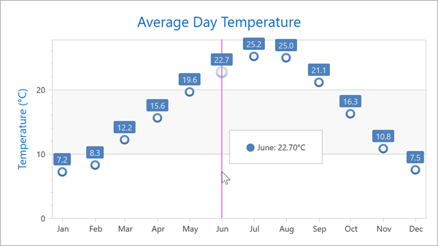

<!-- default badges list -->

<!-- default badges end -->

# How to create a 2D Point chart

This example shows how to create a [2D Point](https://docs.devexpress.com/WPF/5868/controls-and-libraries/charts-suite/chart-control/series/2d-series-types/point-line-and-bubble-series/point) chart and configure its titles, label format, axes, and appearance.

<!-- default file list -->
## Files to Look At

- [Window1.xaml](./CS/Window1.xaml) (VB: [Window1.xaml](./VB/Window1.xaml))
- [Window1.xaml.cs](./CS/Window1.xaml.cs) (VB: [Window1.xaml.vb](./VB/Window1.xaml.vb))

<!-- default file list end -->

## Documentation

- [How to: Create a 2D Point Chart](https://docs.devexpress.com/WPF/6866/controls-and-libraries/charts-suite/chart-control/examples/2d-chart-types/how-to-create-a-2d-point-chart)
- [Series](https://docs.devexpress.com/WPF/6339/controls-and-libraries/charts-suite/chart-control/series/series)
- [2D Series Types](https://docs.devexpress.com/WPF/114223/controls-and-libraries/charts-suite/chart-control/series/2d-series-types)
